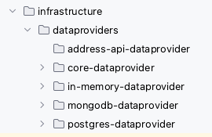
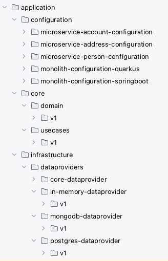

# clean-architecture-software-sample-project
This repository contains a sample project that demonstrates the principles of clean architecture in software development. 
Clean architecture emphasizes the separation of concerns and the independence of the business logic from the frameworks and technologies used in the application.

## Purpose 
The purpose of this project is to provide developers with a practical example of how clean architecture can be implemented in a real-world scenario. 
By examining the code and structure of this sample project, developers can gain a better understanding of the key concepts and patterns involved in clean architecture.

## Clean Architecture - Why?
These days, the IT world is flooded with an overwhelming number of libraries, technologies, frameworks, and platforms to choose from. 
What's considered the ultimate solution today may become outdated tomorrow. What doesn't exist today might become tomorrow's ultimate solution. 
Clean Architecture incorporates principles like SOLID and Domain Driven Design and enforces them through module structuring during compilation. 
However, it's important to note that not everything can be enforced at compile time. 

By embracing these principles, you can design software without getting tied down to specific 
libraries, infrastructure, or other choices right from the start of your project. Instead, you can postpone those decisions until later in the development process. 
This approach also makes it easier to switch libraries or infrastructure if needed, enabling you to create software that can stand the test of time. With Clean Architecture, 
you can keep your options open and ensure that your platform or application remains robust and adaptable in the long run.
**Why Clean Architecture?** Keep your options open and allow your platform or application to endure over time.

## Project Structure
The project is organized into multiple modules, each representing a distinct layer of the clean architecture (see later). The following modules are included:

* **Domain**: This module contains the core business entities, use cases, and interfaces. It represents the innermost layer of the application, encapsulating the business logic.
* **Application**: The application module contains the implementation of the use cases defined in the domain layer. 
It serves as the intermediary layer between the domain and infrastructure layers.
* **Infrastructure**: The infrastructure module deals with the technical implementation details, such as data persistence, external APIs, and frameworks. 
It depends on the domain layer but is independent of other modules. 

## Clean Architecture - My interpretation
The clean architecture concepts I'll be discussing are ideas I've learned from the book "Clean Architecture - A Craftsman's Guide to Software Structure and 
Design (Robert C. Martin Series)." I highly recommend reading the book as it provides a comprehensive understanding of these concepts. 
This repository serves as a condensed summary of the main ideas and includes a Kotlin implementation example. I've designed this setup to facilitate easy evaluation and 
comparison between Spring Boot and Quarkus, as well as to demonstrate the process of extracting microservices or serverless functions from a monolithic application. 
In the following section, I'll share my perspective on clean architecture and apply it to the example project located in the /application directory.

To summarize clean architecture, it's about keeping your options open and minimizing regression risks. When I say "keeping your options open," 
it means that you can definitely be fond of a library, database technology, or any other component, but you shouldn't commit to it for life.
You should have the flexibility to easily swap, add, or remove libraries, databases, and other infrastructure elements.

Now, let's talk about reducing regression risks. Clean architecture introduces the concept of use cases instead of services. 
This may seem like a slight violation of the "don't repeat yourself" (DRY) principle, depending on the actual implementation, 
because code is isolated based on user actions. For instance, instead of having a person service with methods like "create person", "update email",
and "change address" (which may share some private methods), we create separate classes like "CreatePersonUseCase", "UpdatePersonEmailUseCase", and "ChangePersonAddressUseCase" 
without code reuse. In a simple example, this might seem like overkill, but in more complex scenarios, this approach has its advantages. 
It limits the risk of regression to the specific user actions you're working on. If you modify the "CreatePersonUseCase", it won't impact the "UpdatePersonEmailUseCase", 
reducing the chances of unexpected regression. 

Remember, any code you touch can potentially break. Clean architecture enforces this idea by moving away from the traditional "lasagna layered approach" of service-oriented architecture 
(controller layer, service layer, database layer) and embracing an onion layered approach (see the image).

### Core - Domain & usecases
Let's dive into the first layer, the heart of the application stack: the core layer. Sometimes, this layer is even divided into two parts: 
the domain (which includes data classes and POJOs) and the use cases (which house the business logic). This layer holds all the essential business logic and follows a crucial rule: 
it should not rely on any external libraries or dependencies, whether they're developed internally or externally. The only allowed dependency here is the programming language itself 
(in our case, Kotlin). If you're working with plain Java, there's one library that can be up for discussion: Lombok. Since Lombok generates classes at compile time, it can be permitted 
in the core layer. You can easily remove it by replacing the annotated classes with the generated ones if needed.

But does this mean you can't use external libraries at all? Not at all! In fact, you should embrace them (no need to reinvent the wheel), 
but they should be injected into the core layer through interfaces. The same rules apply to database access and other infrastructure-related code: 
no implementations should reside in the core layer, only interfaces for injection.

Here's an important point: although Java and Kotlin natively support file-based access, it should not be part of the core layer. 
Instead, it should be injected via interfaces from an infrastructure module.

Lastly, there's a crucial rule that I believe holds significance: changes in clean architecture should only propagate from the inner layers to the outer layers, not the other way around. 
In other words, **a change in the infrastructure layer should never trigger a change in the core layer** (see image below).

#### Domain
This module houses the data classes, encompassing both the write and read models. However, it's also possible to have only the write model in this module and define the read model at the controller level (in the configuration layer). 
In such cases, you can map the read model using presenters. Personally, since I also retrieve data through use cases (i.e., security validation is for me a part of the core layer), 
I prefer to have both the write and read models in the domain layer.
#### usecases
These classes encapsulate the core business logic and can be aligned with the concept of "commands" in domain-driven design. By making the business logic independent of 
infrastructure and dependencies, we ensure its resilience over time. The layered structure surrounding the core logic, as demonstrated in the example application, 
makes it relatively straightforward to modify infrastructural components or libraries without the need to modify the core/business logic. This approach reduces the hesitation 
to make changes and encourages innovation.

In this section, we come across a discussion point regarding the handling of read operations. One option is to wire repositories directly into (e.g., REST) 
controllers and map them to read models using presenters. However, personally, I prefer implementing read operations through use cases as well. This allows for implementing 
aggregations or incorporating security within the core layer. Thus, the domain layer contains both read and write data models, and the use cases cover operations such as creation, 
editing, deletion, and reading. 

Another principle I adhere to in the use case layer is naming any interface that provides data as a "repository," even if the actual implementation is HTTP-based, such as REST. 
This approach avoids implicitly introducing infrastructure logic into the core layer. For instance, when extracting a microservice from a monolith, a core interface would be renamed 
from "xRepository" to "xClient." I believe that changes in the core layer should be avoided when modifying infrastructure, and therefore, any data provider is considered a "repository" 
in my approach.
### Infrastructure - dataproviders & others
In the infrastructure layer, we handle the implementation of connections with various infrastructural components, as the name suggests. Typically, we organize this layer into submodules 
based on different technologies or components. This modular approach simplifies the process of performing updates, making changes, or replacing specific components.
#### dataproviders
The dataproviders layer primarily focuses on mapping database access. However, from my understanding, it can also encompass API access. For instance, 
if you're calling a REST API of another service, that would also fall under the dataproviders module. The rationale behind this is that a dataprovider's purpose is to retrieve data, 
regardless of whether it originates from a database or an external service.

To illustrate further, let's consider a scenario where you have a monolith containing both person and address data. If you decide to extract the address data into a separate 
microservice, the dataprovider responsible for fetching address data would transition from a database implementation to a REST/GraphQL implementation. 
In my view, this change should not necessitate moving the submodule to a different parent module.

Every technology has its own submodule in which the related dependencies are managed and maintained. E.g., a Postgres submodule should not change when a MySQL or MongoDB version changes.
See image below: we have 4 different data sources; an in-memory database, Postgres and MongoDB database implementation for all or a subset of the repositories defined in the 
use cases layer. Next to that, we have an implementation to fetch address data from an already extracted address microservice (API) in the address-api-dataproviders submodule. 
The latest then would contain a REST client, while the others are database implementations.

### Entrypoints (REST, GraphQL, gRPC, ...)
Some implementations of clean architecture include a separate layer or module within the infrastructure layer specifically for exposing endpoints, such as REST, GraphQL, gRPC, 
and others. However, I have chosen not to follow this approach for the following reason: the responsibility of defining the exposed functionality lies with the configuration layer, 
not the infrastructure layer.

To illustrate, let's consider an example where a monolith has REST APIs for person and address data. If we were to extract a microservice or serverless function alongside it and 
they both shared an "endpoints" submodule, the person data REST endpoints would unintentionally be exposed on the address microservice. This is not the intended purpose. 
Therefore, in my examples, I consider exposing endpoints as part of the configuration layer rather than the infrastructure layer.

An additional benefit of this approach is that the act of exposing endpoints often depends on the chosen framework, such as Spring Boot or Quarkus.
By placing this responsibility in the configuration layer, the infrastructure layer remains unaware of the specific choices made in the configuration layer. 
Thus, when transitioning between frameworks like Spring Boot and Quarkus, the infrastructure layer remains untouched. As a guiding principle of clean architecture states, 
**changes should only propagate from the inside to the outer layers, not the other way around.**
#### Others
As infrastructure is quite generic, other submodules can be part of this section: e.g., thinking about file system access.
### Configuration(s)
Here, in this section, we have the "glue" that connects and wires the different layers of our application. 
It involves making decisions about the infrastructure to use, selecting use cases, determining which endpoints to expose, and choosing the appropriate technologies.
In many cases, this boils down to using Spring or Spring Boot for legacy applications or Quarkus for CloudNative applications.

In our example project, we have multiple subconfigurations. Initially, we started with a monolith built on Quarkus and Spring Boot. 
Then, gradually, we extracted microservices from the monolith, which are now served in a serverless manner. If you're interested in learning how to break down a monolith 
into microservices in a step-by-step fashion, you can check out [this Voxxed Days talk](https://www.youtube.com/watch?v=ekkwMIMVA2Y) on decomposing the monolith with Knative 
(as in the real world, rewriting applications from scratch is often not feasible due to time and budget constraints).

By explicitly defining separate read and write models in the domain layer, I have minimized the need for introducing presenters. 
However, if required, this layer could also be the place to implement presenters, which facilitate the mapping of domain models to resources like REST endpoints.

+ TODO see if it matters for quarkus uberjar

This results in a slightly different drawing on how I implement clean architecture.

## Project setup 
The project setup is straightforward and can be summarized as follows: it comprises a core layer that is divided into domain and use cases. 
Within the project, there are multiple implementations of data providers, which are connected to the applications that utilize them. 
The applications are represented by various configurations, where the necessary components are wired together. Additionally, the project setup includes support for multiversioning. 
To provide a visual representation, the project setup can be depicted as follows:

Or as a Maven project:

## Comparing/Evaluating Quarkus and Spring Boot
TODO

## Extract (Knative) microservices (Quarkus) from monolith (Spring Boot)
At the start of a project, it's often uncertain (and it's actually preferable not to know upfront) whether serverless optimization will be necessary. 
What you can do is begin with a clean architecture-based monolith or mini-service, deploy it, test it, and then, if required, optimize it by leveraging serverless functionality 
if it proves to be advantageous.

In the sample project, you can observe this approach. The initial monolith (i.e., monolith-configuration-springboot) is divided into three microservices 
(i.e., account, address, and person services). These microservices can be served in a serverless manner or as standard Kubernetes deployments. It's important to note that the 
configuration modules are the only components that differ, while the use cases and data providers modules are reused.

If you wish to separate the READ operations to the default hosting method and handle the CREATE/UPDATE/DELETE operations via serverless, you can further divide the configuration classes. 
This separation can be accomplished within a relatively short timeframe. Clean architecture allows you to make these adjustments **after** the main project has been developed, 
**when** you identify the added value in splitting it.

Furthermore, this setup can simplify your testing process. You can run integration tests on the monolith, alleviating the need for local orchestration concerns. 
Then, you can transition to mini- or microservices in a test environment for end-to-end testing (i.e., regression testing). Finally, if necessary, you can further partition 
the system and incorporate serverless functionality.

Overall, clean architecture provides flexibility to adapt and optimize your application architecture as you progress, rather than having to make all these decisions upfront.
## Knative versus AWS Lambda and Azure Functions
When discussing "serverless," the common associations are Knative, AWS Lambda, Azure Functions (and the Google alternative, although not mentioned here for simplicity).
These technologies are often perceived as alternatives to one another. However, from a Clean Architecture perspective, I don't consider them as direct alternatives.

In my view, focused on Clean Architecture principles, Knative exists within the Kubernetes ecosystem and can be seen as part of the "core" layer of your platform. 
Here, the platform/infrastructure itself becomes a variant of an application within the Clean Architecture model. On the other hand, AWS Lambdas, Azure Functions, 
and similar technologies operate on the infrastructure side of the platform. They are specifically optimized to work with file storage, triggers, and other related functionalities.

To map these serverless technologies to a Clean Architecture-based architecture, I revert to the onion layer concept we previously discussed (see image below). 
AWS Lambda, Azure Functions, and similar solutions are injected into the core layer, becoming part of the infrastructure/data providers layer. Knative, on the other hand, 
resides within the core layer as a vendor-agnostic component. This means that you can shift it from on-premises to AWS, from AWS to Google, or from Google to Azure without requiring 
changes in the core layer. The modifications would only be needed in the infrastructure layer. Therefore, this approach aligns with the principles of Clean Architecture.

## Contributing
Contributions to this sample project are welcome! If you find any issues, have suggestions for improvements, or want to add new features, please feel free to submit a pull request. 
Make sure to follow the project's coding conventions and provide clear commit messages.

## Possible pitfalls 

## General remarks
* Use cases: the validation itself is done quick-and-dirty as it's not the main focus of this repository. It can be cleaner: Feel free to reach out on how I do this most of the time.
* Domain entity naming: can be cleaner as well. 
* REST handling: can be cleaner too. E.g., using 204s on creation, ....

## WIP

DRY
startup ./mvnw compile -Dquarkus.profile=db-postgres quarkus:dev -Pmonolith
startup ./mvnw compile -Dquarkus.profile=in-memory quarkus:dev -Pmonolith
startup ./mvnw compile -Dquarkus.profile=db-postgres quarkus:dev -microservice-account

Spring Boot multi module start : mvn spring-boot:run -Pmonolith-springboot -Dspring-boot.run.jvmArguments="-Dspring.profiles.active=inmemory" -pl application/configuration/monolith-configuration-springboot

http://localhost:8080/q/graphql-ui/?

TODO Save usecase ==> work with interfaces

Clean arch : withstand test of time, keep your options open