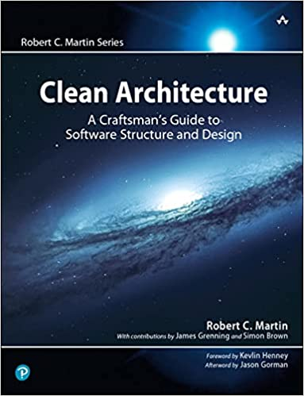
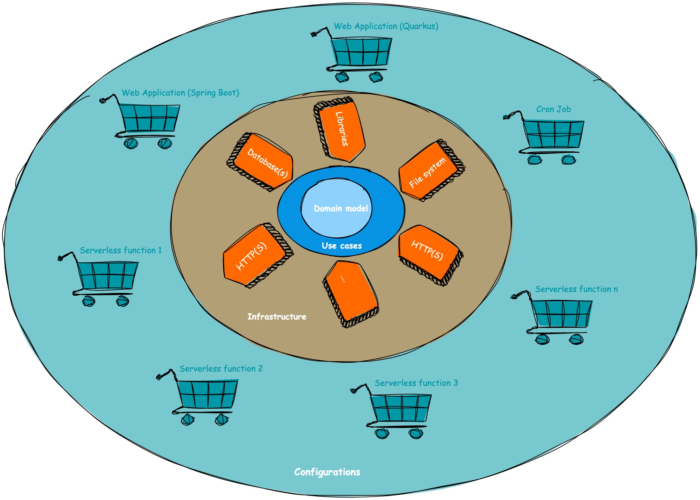
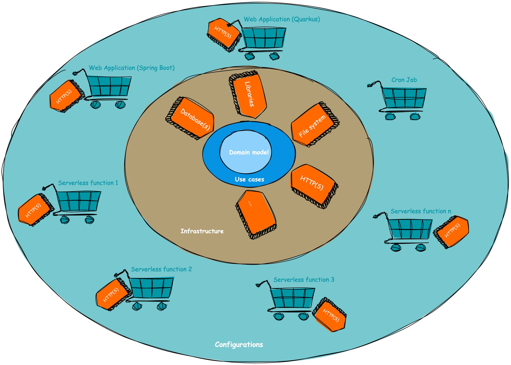
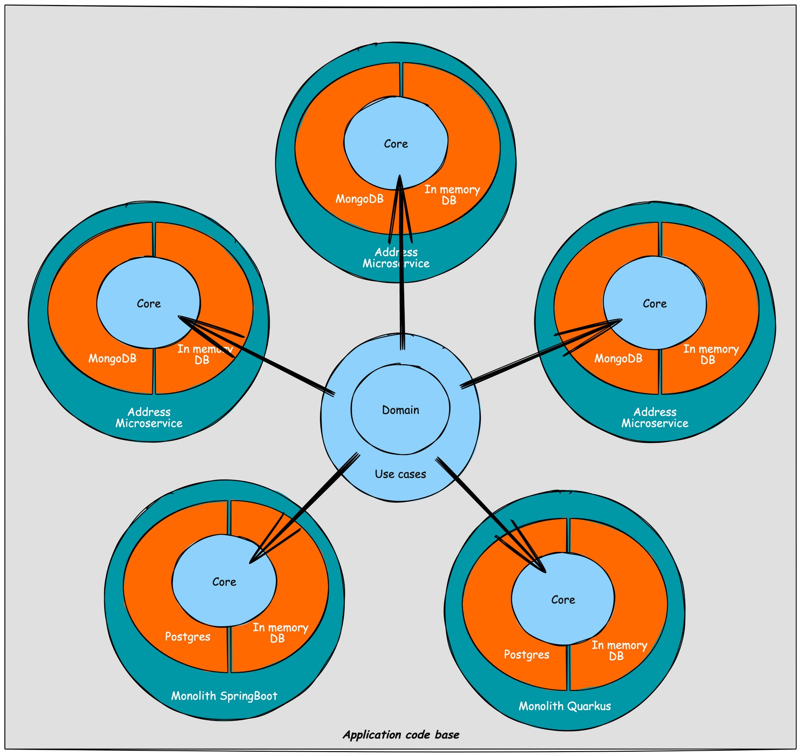
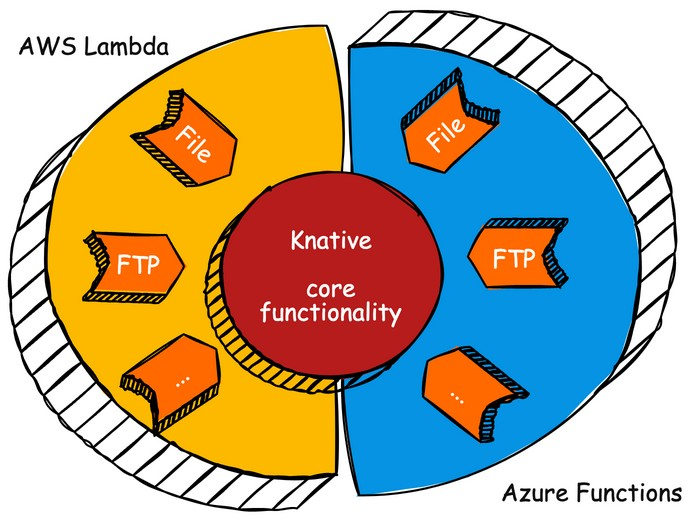

# clean-architecture-software-sample-project
This repository contains a sample project that demonstrates the principles of clean architecture in software development. 
Clean architecture emphasizes the separation of concerns and the independence of the business logic from the frameworks and technologies used in the application.

## Purpose 
The purpose of this project is to provide developers with a practical example of how clean architecture can be implemented in a real-world scenario. 
By examining the code and structure of this sample project, developers can gain a better understanding of the key concepts and patterns involved in clean architecture.

## Clean Architecture - Why?
Nowadays, the IT landscape is swamped with huge amounts of libraries, technologies, frameworks and platforms you can use. What's the holy grail today, 
is outdated tomorrow. What's not existing today, is tomorrow's holy grail. Clean Architecture will come with principles as SOLID and Domain Driven Design
and enforce most of it via module structuring at compile time. Be aware: not everything can be enforced at compile time. By following these principles, 
you can design software while postponing library/infrastructure/... choices until the end of your project development, instead of having to choose it at 
the beginning and be stuck with it. It as well allows you to change libraries/infrastructure/... fairly easy, so it can help you by creating software that 
can withstand the test of time (i.e., software that doesn't need to be rewritten from scratch every x years, or worst case, every x months).
**Why Clean Architecture?** Keep your options open and allow your platform or application to withstand the test of time.

## Project Structure
The project is organized into multiple modules, each representing a distinct layer of the clean architecture (see later). The following modules are included:

* **Domain**: This module contains the core business entities, use cases, and interfaces. It represents the innermost layer of the application, encapsulating the business logic.
* **Application**: The application module contains the implementation of the use cases defined in the domain layer. 
It serves as the intermediary layer between the domain and infrastructure layers.
* **Infrastructure**: The infrastructure module deals with the technical implementation details, such as data persistence, external APIs, and frameworks. 
It depends on the domain layer but is independent of other modules.

## Clean Architecture - My interpretation
The clean architecture concepts I will talk about, are concepts I took/learned from the book "Clean Architecture - A Craftsman's Guide to Software Structure and Design (Robert C. Martin Series)".
As I really advise to read the book, this repository is a very brief summary of what the main concepts are about and an example implementation in Kotlin. 
I will use this setup to make it fairly easy to evaluate/compare Spring Boot with Quarkus and to extract microservices or serverless functions from a monolith. In the next 
section I will share my view on clean architecture and map it on the example project that you can find under /application

The way I would summarize clean architecture is to keep your options open and to reduce the risks on regression. By keeping your options open, I mean that you can 
fall in love with a library, a database technology, ..., but you should never marry with it. You should be able to fairly easy change, add or remove libraries, 
databases, infrastructural components, .... On the "reduce risks on regression" part, clean architecture introduces usecases instead of services. This is violating 
the "don't repeat yourself" (i.e., DRY) principles a little bit (most of it depends on the real implementation) by isolating code to just the user actions. E.g.,
instead of having a person service with "create person", "update email", "changeAddress", .... methods, which are sharing some shared private methods, "CreatePersonUseCase",
"UpdatePersonEmailUseCase", "ChangePersonAddressUseCase", ... classes are created without reuse of code. In this simple example this seems overkill, but the advantage 
of this way of working (especially in more complex scenarios) is that the risk on regression is limited to the user actions you're developing/enhancing/editing: 
Changing the "CreatePersonUseCase" will not affect the "UpdatePersonEmailUseCase", reducing the risk of regression on parts where you don't expect it. As in the end,
every piece of code you touch, can get broken. Clean architecture enforces this by stepping away from the "lasagna layered approach" that service oriented architecture
was (controller layer - service layer - database layer) and introducing an onion layered approach (see image).

### Core - Domain & usecases
The first layer I will talk about, is the center of the application stack: the core layer. Sometimes this layer is even split in domain (i.e., data classes, POJOs)
and usecases (i.e., the business logic). This is the layer that will contain all the business logic and is bound to an important rule: within the core layer, no 
external (or even internal developed) libraries or dependencies should be used. The only dependency which is allowed over here is the programming language (i.e., Kotlin 
in our case). When developing in plain Java, one other library is open for discussion: Lombok. As this is a library which generates classes and works at compile time, 
it can be allowed in the core layer (i.e., if you want to remove it, you can by replacing the annotated classes with the generated ones). Does this then mean 
that you can't use external libraries? No, you can (and should, do not reinvent the wheel): but you'll have to inject them via interfaces. Database access and other 
infrastructure related code has to follow the same rules as for the external libraries: no implementations in the core, only inject it in the core via interfaces. 
Important aspect over here: even though file bases access is natively enabled in Java and Kotlin itself, it should not be part of the core layer and injected via interfaces 
from an infrastructure module.
One last rule, that I believe is important: Changes in clean architecture should only propagate from the inside to the outer layers, not the other way around. So a change in infrastructure 
should never trigger a change in the core layer.
#### Domain
This is the module that contains the data classes. Both write and read models are residating over here. Although it can be as well that you only have your write model over here 
and that you define the read model on controller level (i.e., in the configuration layer) and map on it via presenters. As I fetch the data via usecases as well, I go for having 
the write and the read model in the domain layer.
#### usecases
These classes contain the business logic and can be mapped on "commands" from domain driven design. As the business logic is now infrastructure and dependency independent, 
it should be fairly easy to let it withstand the test of time: the layers around it make it (as you'll see in the example application) fairly easy to change infrastructural components 
and/or libraries without having to touch the core/business logic, resulting less in "we don't dare to touch it", which is killing innovation. One discussion point in this section is what 
to do with read methods. You can as well opt/argue for having repositories wired in the (e.g., REST) controllers and mapped on read models via presenters, but I prefer having read commands 
implemented via usecases to. You can implement some aggregations on this level and/or security is part of the core layer as well (to my opinion). It's for that the domain layer contains 
read and write data models and that the usecases cover creation, editing, deletion and read operations. 
Another principle I use within the usecase layer, is that every interface that will provide data is called a "repository", even if the real implementation would be HTTP based, like REST.
Reason to do so, and to not call it a "xClient" is that this would bring infrastructure logic implicitly in the core layer: when you would extract a microservice from within a monolith, a core 
interface would be renamed from "xRepository" to "xClient" then. Changes in the core layer when changing infrastructure are not allowed, hence everything that provides data, is a "Repository" for me.
### Infrastructure - dataproviders & others
Within the infrastructure layer you implement the connections with infrastructural components (like the name already described). Often you have a submodule per technology or component.
This will make it easier to perform updates, changes or replacements.
#### dataproviders
The dataproviders layer often maps only on database access. To my understanding, this can be database **and** API access: E.g., calling another service's REST API would be 
a dataproviders module as well. Reason behind it: you use a dataprovider to fetch data. If the data is coming from database or an external service, that does not matter. 
E.g., you have a monolith with person and address data. If you extract the address data into a separate microservice, the dataprovider for address data switched from being 
a database implementation to a REST/GraphQL implementation. In my opinion, that should not result in having to move the submodule to another parent module.
### Entrypoints (REST, GraphQL, gRPC, ...)
There are implementation of clean architecture that have a separate layer/module within the infrastructure layer for exposing endpoints (i.e., REST, GraphQL, gRPC, ....). 
I am not doing this for the following reason: it is the configuration layer that will decide on what functionality is getting exposed, so it is the responsability of the 
configuration to define the endpoints. E.g., if you have person and address data REST APIs in a monolith (i.e., see the example application) and you would like to extract a 
microservice/serverless function next to it and they would share an "endpoints" submodule, then the person data REST endpoints would as well be exposed on the address microservice, 
which is not the purpose. So in my examples, my understanding, exposing endpoints are not a part of the infrastructure layer, but part of the configuration layer. 
An extra added value of developing like this: the exposing of the endpoints is often framework dependent (e.g., SpringBoot, Quarkus, ...). By moving this to the configuration layer, 
your infrastructure layer is unaware of the choice you've made in the configuration layer and you don't have to touch it when interchanging SpringBoot with Quarkus or the other 
way around. **Changes in clean architecture should only propagate from the inside to the outer layers, not the other way around.**
#### Others
As infrastructure is quite generic, other submodules can be part of this section: e.g., thinking about file system access.
### Configuration(s)
Over here you have the "glue", the wiring of your application and its layers: which infrastructure to use, which usecases, which endpoints your exposing and in which technology, .... 
Often this comes down to Spring or SpringBoot for legacy applications or Quarkus for CloudNative applications. In our example project we have multiple subconfigurations: 
we started with a monolith (in Quarkus and SpringBoot), and then gradually extracted microservices from the monolith. These microservices are then serverless served. 
If you're interested in how you would break down the monolith into microservices in a step-by-step flow, check out [this Voxxed Days talk](https://www.youtube.com/watch?v=ekkwMIMVA2Y) about decomposing the monolith with Knative
(as in the real world, you often don't have the time and especially not the budget to always rewrite applications from scratch). By having an explicit read and write 
model in the domain layer, I've less need to introduce presenters. Otherwise, this would as well be the location where you could implement presenters, mapping domain models 
to e.g., REST resources.

+ see if it matters for quarkus uberjar

This results in a slightly different drawing on how I implement clean architecture.

## Project setup 

## Comparing/Evaluating Quarkus and Spring Boot
TODO

## Extract (Knative) microservices (Quarkus) from monolith (Spring Boot)
At the beginning of your project, you often don't know (and you should not know it upfront) if you would optimize with serverless functions or not.
What you can do, is start a clean architecture based monolith or miniservice, deploy it, test it, and if needed, optimize it by exposing it serverless 
if it seems to be an added value. Within the sample project, you can have a look: the monolith (i.e., monolith-configuration-springboot) is split into 
three microservices (i.e., account, address and person service). These can be served serverless or as a default Kubernetes deployment. Notice that only 
the configuration modules differ: usecases and dataproviders modules are reused. If you now would like to split the READ operations to the default way 
of hosting and the CREATE/UPDATE/DELETE operations via serverless, you can even split the configuration classes further. Notice that this can be done within 
a short time frame, so clean architecture allows you to perform this **after** the main project is written **and** when you see added value in splitting it.
Next to that, you can as well use such a setup to make your testing life easier: run integration tests on the monolith, so that you don't have to worry about 
orchestration locally, go with mini- or microservices to a test environment on which you can run end-to-end testing (i.e., regression testing) and later on 
again, if needed) split it even further down and extend it with serverless functionality.

## Knative versus AWS Lambda and Azure Functions
When you say "serverless", you often think about Knative, AWS Lambda, Azure Functions (and the Google alternative, but for the sake of ease, this is left out 
in this text). You then see these as alternatives for each other. But are they truly alternatives of each other? In my opinion, focused on Clean Architecture, 
they're not: Knative lives in the Kubernetes landscape and could be seen as within the "core" layer of your platform (here the platform/infrastructure becomes 
the variant of an application in the Clean Architecture model). The AWS Lambdas, Azure Functions, ... are playing on the infra side of the platform and are 
highly optimized to play with their file storage, triggers, .... How I would map these then on a Clean Architecture based architecture is by going back to the 
onion layer we saw before (see image below): AWS Lambda, Azure Functions, ... injected into the core, and being part of the infrastructure/dataproviders layer and Knative in the 
core as a vendor-agnostic core layer: you can shift it to on prem, from AWS to Google, from Google to Azure, ..., in the core layer, no changes would be required, 
only in the infrastructure layer: hence, were compliant with the Clean Architecture philosophy.

## Contributing
Contributions to this sample project are welcome! If you find any issues, have suggestions for improvements, or want to add new features, please feel free to submit a pull request. 
Make sure to follow the project's coding conventions and provide clear commit messages.

## WIP
TODO extend README

usecases => validation ugly
naming domain => ugly
no created status, but just ref
DRY
startup ./mvnw compile -Dquarkus.profile=db-postgres quarkus:dev -Pmonolith
startup ./mvnw compile -Dquarkus.profile=in-memory quarkus:dev -Pmonolith
startup ./mvnw compile -Dquarkus.profile=db-postgres quarkus:dev -microservice-account

Spring Boot multi module start : mvn spring-boot:run -Pmonolith-springboot -Dspring-boot.run.jvmArguments="-Dspring.profiles.active=inmemory" -pl application/configuration/monolith-configuration-springboot

http://localhost:8080/q/graphql-ui/?

TODO Save usecase ==> work with interfaces

Clean arch : withstand test of time, keep your options open